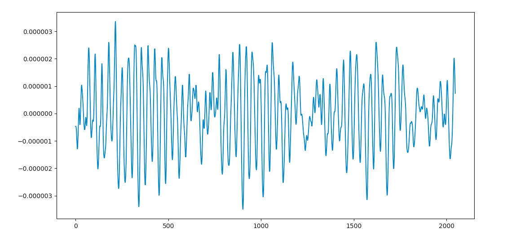
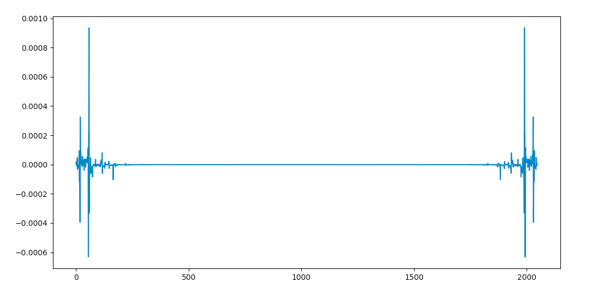
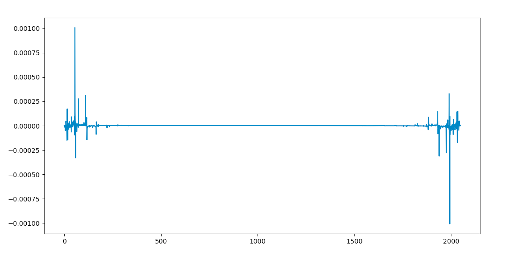
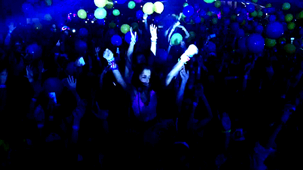
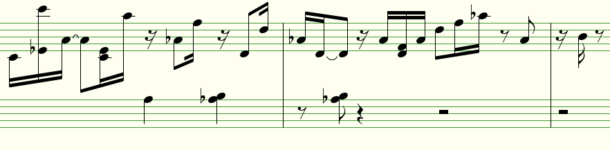

## NOISE IN THE MACHINE

**Audio Waveform Generation**

*Christopher Winn*

*Fig 1. A block of 2048 frames of audio data. Sound wave amplitude, roughly corresponding to air pressure or height of speaker, is plotted against time.*

___

### Introduction

While there have been some successful attempts at creating convincing machine composers, these have so far all taken the track of training on score or midi derived data sets. There are currently no successful machine music generators trained only on the audio waveform data. This fact is surprising given the state of the field in image and video generation -- it seems that this is something deep learning algorithms ought to be able handle, and handle well. This capstone presents an attempt at training a neural net directly on the audio waveform of a performance of Bach's 24 Preludes and Fugues (from the *Well-Tempered Clavier*) in an attempt to produce fully rendered audio data with recognizable traces of original musical ideas.

Given time constraints I don't expect to be able to succeed here where others have failed, but I do want to gain some insight into where the difficulties lie.

### Preprocessing

The first step is to transform the data into a manageable form. Music data is dense -- given one second of audio in typical CD or streaming quality, we have 44,100 samples or 'frames' of data representing air pressure across time[1](#Nyquist-Shannon) (see fig 1). This is difficult to train on -- compare this to data in the classic reference [MNIST](https://en.wikipedia.org/wiki/MNIST_database) database, where each training block image represents only 28x28 pixels of data. One method to make the data a little more manageable is to decompose sound waves into eigenfunctions, or Fourier series, and represent these functions as Dirac delta function peaks in the frequency domain (see figures below). The frequency domain representation lives in a complex space, where the real part corresponds with the magnitude of frequency in the block, and the imaginary represents the phase.

*Fig 2. The same block of 2048 frames from above, transformed and here represented in the real part of the frequency domain, corresponding to magnitude of frequency.*

*Fig 3. The imaginary part, corresponding to phase of the frequency.*

For the sake of training, I split 4 hours of audio data (the performance length of the Bach's complete Preludes and Fugues) into blocks of 2048 frames, and do an invertible Fourier Transform from the time domain into the frequency domain using numpy's fast Fourier transform algorthm.

### Training

My first objective is just to get a working neural net running on my data. For this step of the process, I've repurposed code from Matt Vitelli and Aran Nayebi's project on algorithmic music generation from RNNs[2](#Vitelli). Their project uses a recurrent neural net with an LSTM architecture, implemented in Keras. After one hour of training, I get white noise with clipping, most likely due to the nature of my slicing preprocess.

### Comparison with MIDI trained generator:

In comparison, Karpathy's[3](#Karpathy) multi-layer recurrent neural network architecture for training on character-level language models  does fairly well at generating what sounds like original improvisation after training on about 50 MIDI files of classical piano music parsed into text[4](#dtinh).  

*Fig 4. Machine composer or Milton Babbitt?*

**References**

Matt Vitelli, Aran Nayebi GRUV -- https://github.com/MattVitelli/GRUV

Thai Pangsakulyanont midi <-> txt parser -- https://gist.github.com/dtinth

Andrej Karpathy char-rnn -- https://github.com/karpathy/char-rnn

---

<a name="Nyquist-Shannon">1</a> The sampling rate of 44.1kHz is set within this range due to the [Nyquist-Shannon sampling theorem](https://en.wikipedia.org/wiki/Nyquist%E2%80%93Shannon_sampling_theorem), which says that the sampling frequency must be greater than twice the maximum frequency one wishes to produce. The human hearing range maxes out at around 20kHz.

<a name="Vitelli">2</a>  Vitelli's code and description can be seen [here](https://github.com/MattVitelli/GRUV), and musical output [here](https://www.youtube.com/watch?v=0VTI1BBLydE). Unfortunately, his model seems to be overfit to the training data, as generated music appears to be regurgitating samples from his music library. 

<a name="Karpathy">3</a>  Karpathy implements an LSTM rnn using Torch/Lua. See the [repo](https://github.com/karpathy/char-rnn) for more on this versatile architecture. 

<a name="dtinh">4</a>  [Pangsakulyanont](https://gist.github.com/dtinth) uses ruby with the [midilib](https://github.com/jimm/midilib) library for this parser. There are a couple of limitations here that can be improved upon, such as a fixed tempo, low tick-rate resolution, and no ability to separate instrument tracks.
